

**SNIA SwordfishTM Emulator API Developer Guide**
==========

The purpose of this Developer Guide is to provide an overview of how the
Swordfish API Emulator works. A user guide is also available.

## Contents
- [Disclaimer](#disclaimer)
- [Requirements](#requirements)
- [Introduction](#introduction)
  * [Static Resources](#static-resources)
  * [Dynamic Resources](#dynamic-resources)
  * [Static versus Dynamic Resources](#static-versus-dynamic-resources)
  * [The resource_manager.py file](#the-resource\_managerpy-file)
  * [The utils.py file](#the-utilspy-file)
- [Implementing Dynamic Resources](#implementing-dynamic-resources)
  * [Dynamic Resource Template Files](#dynamic-resource-template-files)
  * [Dynamic Resource API Files](#dynamic-resource-api-files)
- [Redfish Emulator Dynamic Resources](#redfish-emulator-dynamic-resources)
- [Swordfish Dynamic Resources](#swordfish-dynamic-resources)

Disclaimer
==========

The information contained in this publication is subject to change without
notice. The SNIA makes no warranty of any kind with regard to this
specification, including, but not limited to, the implied warranties of
merchantability and fitness for a particular purpose. The SNIA shall not be
liable for errors contained herein or for incidental or consequential damages in
connection with the furnishing, performance, or use.

Suggestions for revisions should be directed to <http://www.snia.org/feedback/>

Copyright © 2016-2019 Storage Networking Industry Association.

[Top](#section)

Requirements
============

The following are the tested configurations for Linux and Windows environments.

**Python version:** 2.7, 3.1, 3.6. Preferred Python version is 3.6 or higher.

**Ubuntu:** 16.4v

**Windows:** 7, 8 and 10

[Top](#section)

Introduction
============

**SNIA Swordfish™ Specification**

The SNIA Swordfish™ specification helps to provide a unified approach for the
management of storage and servers in hyperscale and cloud infrastructure
environments, making it easier for IT administrators to integrate scalable
solutions into their data centers. SNIA Swordfish is an extension of the DMTF
Redfish specification, and the same easy-to-use RESTful interface is used, along
with JavaScript Object Notation (JSON) and Open Data Protocol (OData), to
seamlessly manage storage equipment and storage services in addition to servers.

SNIA Swordfish is designed to integrate with the technologies used in cloud data
center environments and can be used to accomplish a broad range of storage
management tasks from the simple to the advanced.

SNIA Swordfish has been designed around management use cases that focus on what
IT administrators need to do with storage equipment and storage services in a
data center. As a result, the API provides functionality that simplifies the way
storage can be allocated, monitored, and managed.

[Top](#section)

**Swordfish Scalable Storage Management API Emulator**

The Swordfish API Emulator can emulate a Swordfish-based system that responds to
create, read, update, and delete RESTful API operations to allow developers to
model new Swordfish functionality, test clients, demonstrate Swordfish, and do
other similar functions.

The Swordfish API Emulator extends the DMTF Redfish Interface Emulator,
(<https://github.com/DMTF/Redfish-Interface-Emulator>) adding code that supports
dynamic interactions with all of the Swordfish schema.

Installation instructions are documented in the Swordfish Emulator README file
(Note: This document includes pointers to the Redfish Interface Emulator, found
at <https://github.com/DMTF/Redfish-Interface-Emulator>.)

The Redfish Interface Emulator contains Static and Dynamic resources. Static
resources are read-only instances created from Redfish mockups in the
api_emulator/redfish/static directory. Dynamic resources are modifiable
instances whose behavior is defined by Python API and template files. The API
files define the resource behavior for individual RESTful operations, and the
template files are used to create initial versions of resources.

The Swordfish API Emulator resources are all dynamic, so the Python API and
template files are included for both singleton (single instances) and collection
resources. Once the resource instances are created for Swordfish, they are
stored as files in the Resources directory. Create, Read, Update and Delete
operations can be done on these dynamic resources using RESTful operations.

The Swordfish API Emulator code is maintained on GitHub by the SNIA, and the
Redfish Interface Emulator code is maintained on GitHub by the DMTF.

It is important to understand the following before working with the emulator
code.

[Top](#section)

Static Resources
----------------

Static resources in the emulator are read-only instances of resources created
from mockups that are kept in the api_emulator/redfish/static directory. The
Redfish Interface Emulator documentation has instructions for using static
mockups. This documentation can be found in the Readme file or in Redfish
Interface Emulator “doc” folder.

[Top](#section)

Dynamic Resources
-----------------

Dynamic resources in the emulator are resources that can be created, read,
updated, and deleted using POST, GET, PUT, PATCH, and DELETE operations.

Static versus Dynamic Resources
-------------------------------

Static and Dynamic resources in the emulator differ in how they respond to
RESTful operations, and in how they are populated.

Static resources are read-only. They respond to GET and DELETE operations, and
they cannot be altered by POST, PUT, or PATCH operations.

Dynamic resources respond to all the RESTful operations that have been defined
for them. Each dynamic resource has a Python API file in the
api_emulator/redfish directory that defines how the resource responds to each of
the possible RESTful operations (GET, POST, PUT, PATCH, and DELETE).

Static resources in the emulator are populated by placing appropriate JSON
mockup folders into the api_emulator/redfish//static directory and editing the
api_emulator/resource_manager.py file. Note that the
api_emulator/resource_manager.py file must be edited to establish which mockups
in the api_emulator/redfish/static directory will be used by the emulator. All
Swordfish resources are dynamic, and only Redfish mockups are currently found in
the api_emulator/redfish/static directory.

Dynamic resources in the emulator are populated using POST operations that are
sent to the collection where a new resource is desired. The new resource
instance is specified by a JSON description in the body of the POST command.

As a special case in the emulator, default dynamic resources can also be created
by sending a POST command with an empty body to a named resource that does not
yet exist in a collection. This causes a new default resource instance with the
given name to be created in the collection.

Each dynamic resource has a Python template file in the
api_emulator/redfish/templates directory that defines the default resource
instance. There are two sections in each template file. The “template
declaration” section defines the contents of a new resource, and the “function”
section defines how the “template declaration” section is used to create the new
resource. When a default resource is created from a template file, default
versions of all the resource’s defined subresources are also be created.

The special case for creating default resources is intended to serve as a
starting point for manually adding new resources to a collection. PATCH
operations can then be used to manually customize the new resources after they
have been added to a collection.

[Top](#section)

The resource_manager.py file
----------------------------

The resource_manager.py file establishes all the static and dynamic resources
made available by the emulator, and it also defines the Redfish service root for
the emulator. It sets up an environment that properly interacts with Flask and
Flask-Restful to make the static and dynamic resources available via RESTful
operations that conform to the Redfish and Swordfish specifications.

The resource_manager.py file initializes the static resources by reading
specific mockups in from the api_emulator/redfish/static folder and making them
available at the proper URLs.

The resource_manager.py file initializes the dynamic resources by importing the
Python API files that define how dynamic resources respond to RESTful operations
and then “attaching” specific URLs to each of the Python API files.

The figure below shows how the Python API files are imported.

The figure below shows how the Python API file functions are “attached” to the
proper URLs.

The resource_manager.py file sets up the Redfish service root by defining the
service root collection, as shown in the figure below.

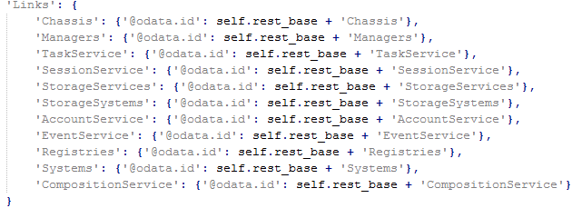

The utils.py file
-----------------

The Redfish Interface Emulator file utils.py file contains a small set of
support functions for the emulator. The Swordfish emulator adds a new function
to this file called “Update_collections_json()” that updates the count of
resources in a collection if any item is added to or deleted from the
collection.

The figure below shows the Update_collections_json() function.

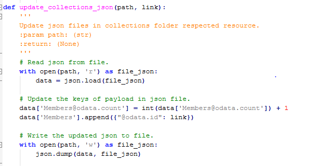

[Top](#section)

Implementing Dynamic Resources
==============================

The dynamic resources are kept in the Resource directory. To create a new
dynamic resource, the developer must create new Python API and template files.

Dynamic Resource Template Files
-------------------------------

Python template files are kept in the api_emulator/redfish/templates directory.
These files are used by the emulator to create new default instances of dynamic
resources. There are two sections in each template file, the “template
declaration” section and the “function” section. The “template declaration”
section defines the contents of a new resource, and the “function” section
defines how the “template declaration” section is used to create the new
resource.

The figure below shows an example of the “template declaration” section of a
template file for a dynamic resource. The contents of the template declaration
can include substitution fields (“{rb}” and “{id}” in this figure) that will be
updated when the new resource is created.

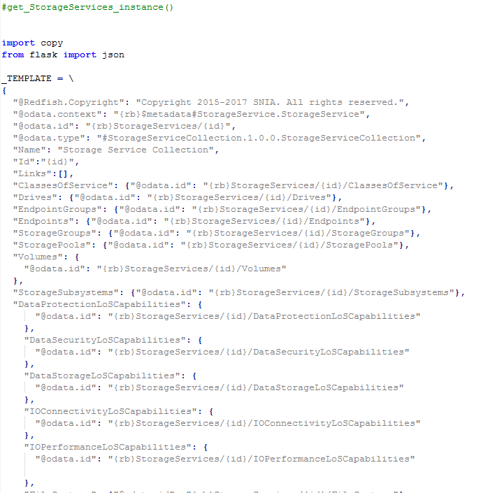

The figure below shows an example of the “function” section of a template file
for a dynamic resource. This section of the template file provides a function
that creates a new instance of the dynamic resource. This function creates a
copy of the template declaration and then fills in the substitution fields as
necessary with data taken from the “wildcards” argument.

[Top](#section)

Dynamic Resource API Files
--------------------------

Python API files are kept in the api_emulator/redfish directory. These files are
used by the emulator to define how dynamic resources respond to GET, PUT, POST,
PATCH, and DELETE commands.

The figure below shows an example of how the response to a POST command is
defined. In this case, it will add a new resource to a collection and update the
count of resources in the collection.

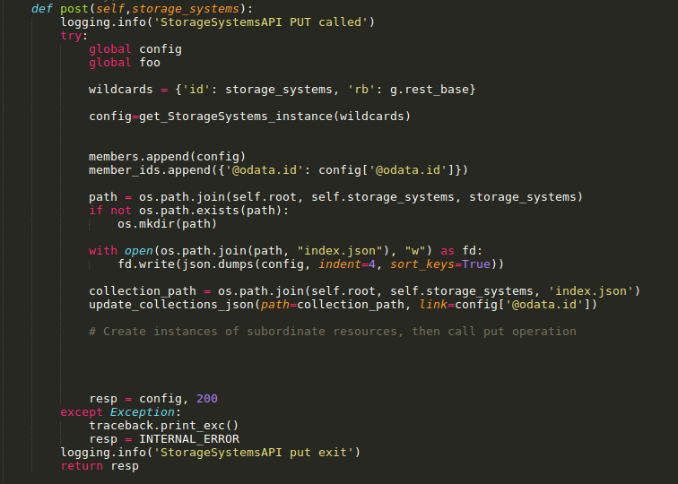

The figure below shows an example of how the response to a PUT command is
defined.

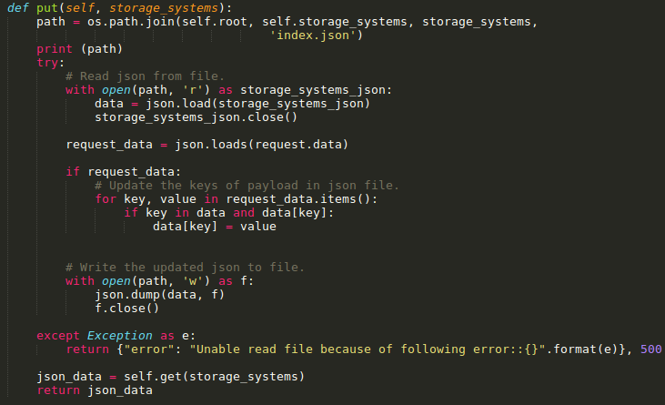

The figure below shows an example of how the response to a DELETE command is
defined. In this case, it will delete the resource and update the count of
resources in the collection.

[Top](#section)

Redfish Emulator Dynamic Resources
==================================

In the Redfish Interface Emulator, static resources and dynamic resources are
only stored in memory, and any changes will be lost if the emulator is
restarted.

As an example, consider the figure below. It shows that the current default
configuration of the emulator has a Chassis collection that contains 13 items.

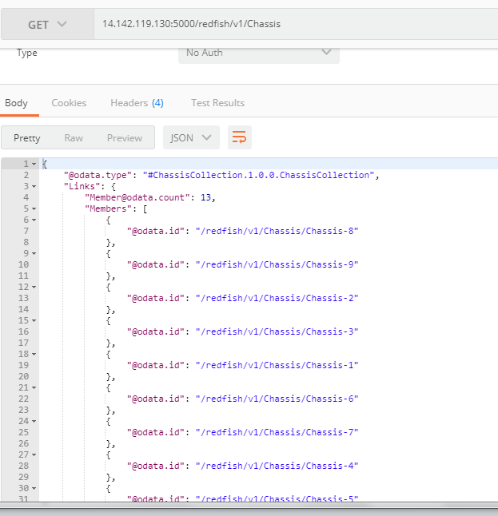

The figure below shows a DELETE command being used to remove “Chassis-5” from
the Chassis collection.

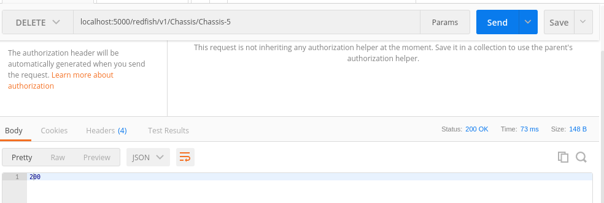

The figure below shows that “Chassis-5” is no longer in the Chassis collection,
and that the count of resources in the Chassis collection is now 12.

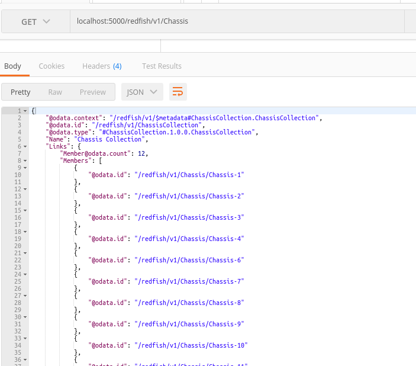

However, if the emulator is restarted, this change will be lost, and “Chassis-5”
will be again be included in the Chassis collection, since that is the current
default configuration for the Redfish Interface Emulator.

Note: Changes to Redfish resources are lost when the emulator is restarted, but
changes to Swordfish resources are not lost when the emulator is restarted. This
is because Swordfish resources are preserved in the Resources directory.

[Top](#section)

Swordfish Dynamic Resources
===========================

The Swordfish API Emulator presents dynamic resources associated with Swordfish
functionality. This section covers how this works, using StorageServices as an
example.

StorageServices is a dynamic resource, so it has one template file and API file
associated with it. To make them easier to identify, both files have
“StorageServices” as part of their file names. The template file name is
“StorageService.py” which is kept in the api_emulator/swordfish/template
directory, and the API file name is “storageservice_api.py” which is kept in the
api_emulator/redfish directory.

The StorageServices.py template file is imported by the storageservice_api.py
file, as shown in the figure below. This allows the storageservice_api.py file
to create default StorageServices resources by calling the
get_StorageServices_instance function.

The storageservices_api.py file contains two different classes. One is a
collection class and the other is an API class. The collection class defines how
the StorageServices collection responds to RESTful commands, and the API class
defines how individual resources in the StorageServices collection respond to
RESTful commands.

The storageservices_api.py file’s StorageServices collection class defines
support for GET commands, which are used to read the current members of the
StorageServices collection. This is shown in the figure below.

The storageservices_api.py file’s StorageServices API class defines support for
GET, POST, PATCH, and DELETE commands. The figure below shows the support for
POST commands, which are used to add new default resources to the
StorageServices collection. Note that when the new default dynamic resource is
created, its default dynamic subresources are also created.

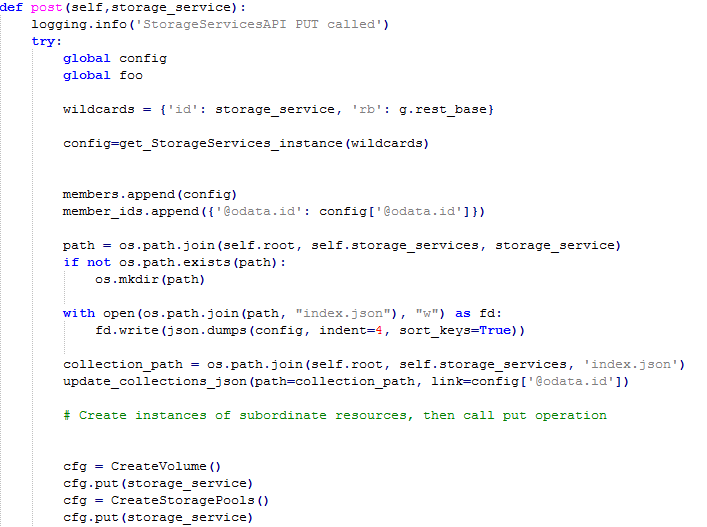

Swordfish dynamic resources are kept in the Resources directory, in a directory
hierarchy that reflects the parent-child relationships between the different
resources. Whenever a Swordfish dynamic resource is created or changed, it is
preserved in this directory hierarchy. This means that the same Swordfish
dynamic resources will be present even if the emulator is restarted.

When a new default dynamic resource is created, its dynamic subresources are
also created. As an example, the following sequence of figures shows the code
used to create a new default Volume dynamic resource as a subresource for a new
default StorageServices resource.

The figure below shows the CreateVolume class in the volumes_api.py file that is
kept in the api_emulator/redfish directory.

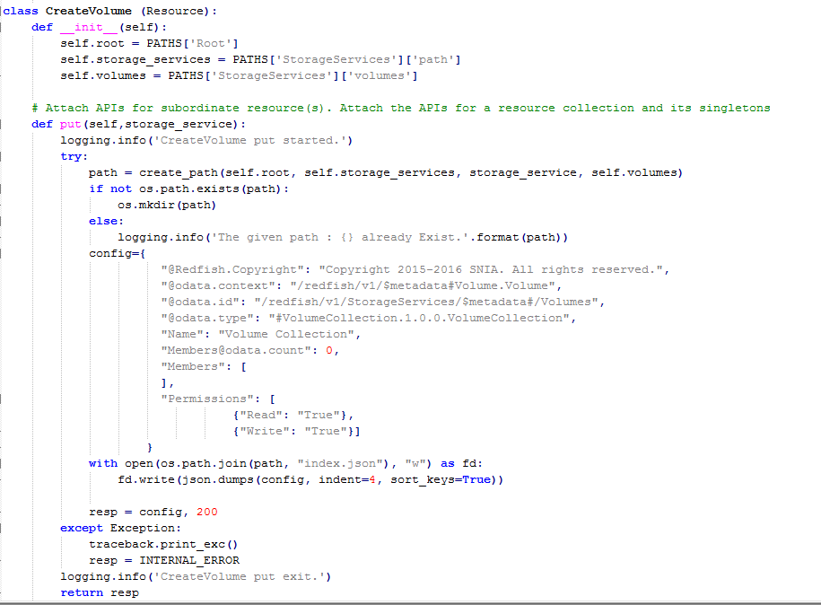

The figure below shows that the CreateVolume class in the volumes_api.py file is
imported by the storageservices_api.py file.

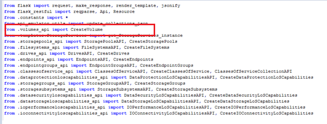

When the storageservices.py file creates a new default dynamic resource for the
StorageServices collection, it also creates the associated new default dynamic
subresources. The figure below shows the CreateVolume call made by the
storageservices_api.py file to create a new Volume subresource. Other
subresources are created similarly.

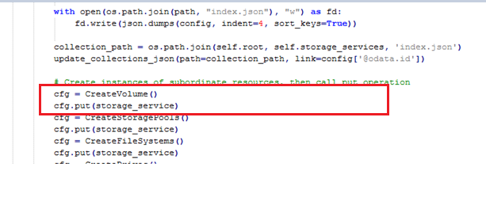
==========

[Top](#section)

Additional information about the SNIA Swordfish specification and usage is
available at https://www.snia.org/swordfish and <https://github.com/SNIA>.
